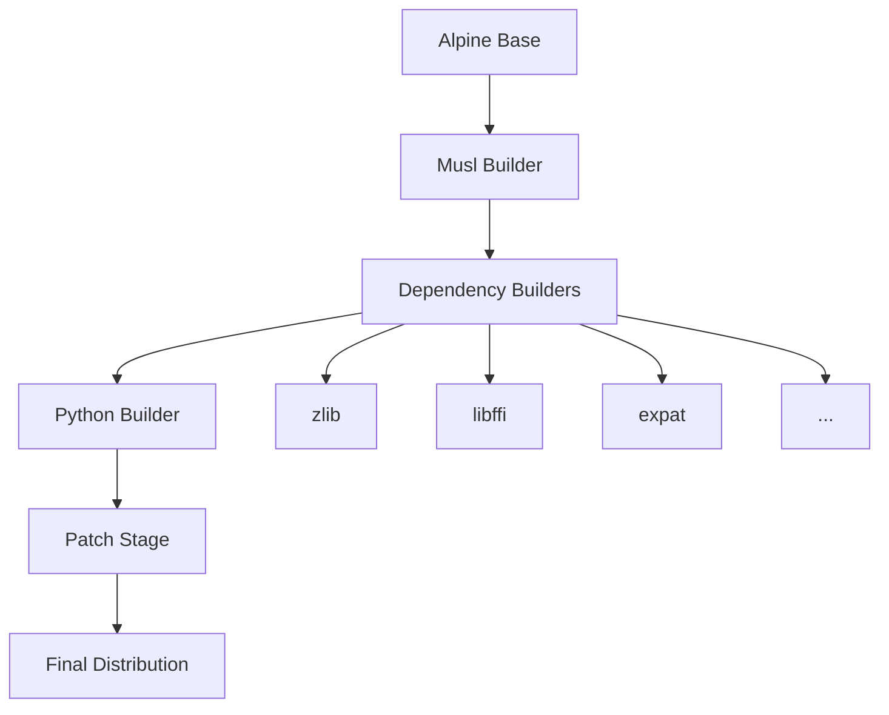

# System Architecture

A deep dive into the design and implementation of Standalone Python's portable architecture.

## Table of Contents

- [Overview](#overview)
- [Design Principles](#design-principles)
- [System Components](#system-components)
- [Multi-Stage Build Process](#multi-stage-build-process)
- [Musl Libc Integration](#musl-libc-integration)
- [ELF Patching Mechanism](#elf-patching-mechanism)
- [Wrapper Scripts](#wrapper-scripts)
- [Portability Mechanism](#portability-mechanism)
- [Dependency Management](#dependency-management)
- [Runtime Behavior](#runtime-behavior)

## Overview

Standalone Python achieves complete portability through a carefully orchestrated combination of:

1. **Custom C Library**: Uses musl libc instead of glibc
2. **Static Linking**: All dependencies bundled in the distribution
3. **ELF Manipulation**: Dynamic interpreter path modification
4. **Wrapper Scripts**: Runtime environment configuration
5. **Relative Paths**: Location-independent execution

### Architecture Diagram

```
┌─────────────────────────────────────────────────────────┐
│                   User Application                       │
└─────────────────────────────────────────────────────────┘
                              ↓
┌─────────────────────────────────────────────────────────┐
│                    Wrapper Scripts                       │
│         (python-wrapper, pip-wrapper)                    │
└─────────────────────────────────────────────────────────┘
                              ↓
┌─────────────────────────────────────────────────────────┐
│                   Python Interpreter                     │
│              (python3.12-real binary)                    │
└─────────────────────────────────────────────────────────┘
                              ↓
┌─────────────────────────────────────────────────────────┐
│                  Shared Libraries                        │
│    (OpenSSL, SQLite, readline, ncurses, etc.)          │
└─────────────────────────────────────────────────────────┘
                              ↓
┌─────────────────────────────────────────────────────────┐
│                      Musl Libc                          │
│     (/tmp/StAnDaLoNeMuSlInTeRpReTeR-musl-*.so)        │
└─────────────────────────────────────────────────────────┘
                              ↓
┌─────────────────────────────────────────────────────────┐
│                    Linux Kernel                         │
└─────────────────────────────────────────────────────────┘
```

## Design Principles

### 1. Zero System Dependencies

**Principle**: The distribution must not depend on any system libraries.

**Implementation**:
- Bundle all required libraries
- Use musl libc instead of system glibc
- Include all Python standard library modules

### 2. Complete Relocatability

**Principle**: The installation can be moved anywhere without breaking.

**Implementation**:
- Use relative paths for all internal references
- Dynamic environment configuration via wrappers
- Runtime path resolution with `$ORIGIN`

### 3. Transparent Operation

**Principle**: Users shouldn't need to know about the internal complexity.

**Implementation**:
- Wrapper scripts handle all setup
- Automatic musl interpreter bootstrapping
- Standard Python command-line interface

### 4. Minimal Footprint

**Principle**: Keep the distribution as small as possible.

**Implementation**:
- Strip all binaries
- Optimize compilation flags
- Share common libraries
- Compress distribution archives

## System Components

### Core Components

| Component | Purpose | Location |
|-----------|---------|----------|
| Python Binary | Actual Python interpreter | `bin/python3.12-real` |
| Wrapper Scripts | Environment setup | `bin/python`, `bin/pip` |
| Standard Library | Python modules | `lib/python3.12/` |
| Shared Libraries | Dependencies | `shared_libraries/lib/` |
| Musl Interpreter | C library | `/tmp/StAnDaLoNe*.so` |
| Site Packages | User packages | `lib/python3.12/site-packages/` |

### Dependency Tree

```
Python Interpreter
├── musl-libc (C library)
├── zlib (compression)
├── libffi (foreign function interface)
├── expat (XML parsing)
├── gdbm (database)
├── lzma (compression)
├── gettext (internationalization)
├── ncurses (terminal handling)
├── openssl (cryptography)
├── readline (command-line editing)
├── tcl (Tcl/Tk support)
├── xz (compression)
├── bzip2 (compression)
└── sqlite3 (database)
```

## Multi-Stage Build Process

The build uses a 13-stage Docker process to create a clean, minimal distribution:

### Build Stages

```
Stage 1: musl_builder
    ↓ (Builds musl-libc toolchain)
Stage 2: libz_builder
    ↓ (Builds zlib compression)
Stage 3: ffi_builder
    ↓ (Builds libffi)
Stage 4: expat_builder
    ↓ (Builds XML parser)
Stage 5: gdbm_builder
    ↓ (Builds GNU database)
Stage 6: lzma_builder
    ↓ (Builds LZMA compression)
Stage 7: gettext_builder
    ↓ (Builds i18n support)
Stage 8: ncurses_builder
    ↓ (Builds terminal library)
Stage 9: openssl_builder
    ↓ (Builds SSL/TLS)
Stage 10: readline_builder
    ↓ (Builds readline)
Stage 11: tcl_builder
    ↓ (Builds Tcl)
Stage 12: xz_builder
    ↓ (Builds XZ utils)
Stage 13: bzip2_builder
    ↓ (Builds bzip2)
Stage 14: sqlite3_builder
    ↓ (Builds SQLite)
Stage 15: python_builder
    ↓ (Builds Python)
Stage 16: patch_stage
    ↓ (Patches ELF files)
Final Stage: Creates distribution
```

### Build Flow Visualization



## Musl Libc Integration

### Why Musl?

Musl libc provides several advantages over glibc:

1. **Static linking friendly**: Designed for static compilation
2. **Smaller size**: ~1MB vs glibc's ~8MB
3. **Cleaner code**: Simpler, more maintainable
4. **Better portability**: Works across all Linux versions

### Musl Build Configuration

```makefile
# config.mak for musl-cross-make
TARGET = x86_64-linux-musl
OUTPUT = /opt/musl
GCC_VER = 13.2.0
MUSL_VER = 1.2.4
LINUX_VER = 6.1.36
```

### Runtime Musl Bootstrap

The musl interpreter is copied to `/tmp` at runtime:

```bash
# Magic path for musl interpreter
/tmp/StAnDaLoNeMuSlInTeRpReTeR-musl-x86_64.so

# Why /tmp?
# - Always writable
# - Available on all systems
# - Cleaned on reboot
# - No root required
```

## ELF Patching Mechanism

### The Problem

Standard Linux binaries have hardcoded interpreter paths:

```bash
# Normal Python binary
$ readelf -l /usr/bin/python | grep interpreter
[Requesting program interpreter: /lib64/ld-linux-x86-64.so.2]
```

### The Solution

We patch all ELF files to use our musl interpreter:

```bash
# After patching
$ readelf -l python3.12-real | grep interpreter
[Requesting program interpreter: /tmp/StAnDaLoNeMuSlInTeRpReTeR-musl-x86_64.so]
```

### Patching Process

The `interpreter-patcher.sh` script:

1. **Find all ELF binaries**:
   ```bash
   find /opt/python -type f -executable -exec file {} \; | grep ELF
   ```

2. **Calculate relative paths**:
   ```bash
   # For each binary, calculate ../.. to reach root
   relative_path="../../shared_libraries/lib"
   ```

3. **Patch with patchelf**:
   ```bash
   patchelf --set-interpreter /tmp/StAnDaLoNe*.so \
            --set-rpath '$ORIGIN/../shared_libraries/lib' \
            binary
   ```

### RPATH Configuration

The `$ORIGIN` special variable enables relative library loading:

```
$ORIGIN/../shared_libraries/lib
        ↑
        Expands to directory containing the binary
```

This makes the entire distribution relocatable.

## Wrapper Scripts

### Python Wrapper

The `python-wrapper` script sets up the environment:

```bash
#!/bin/sh
# Simplified view of python-wrapper

# 1. Find installation directory
SCRIPT_DIR="$(cd "$(dirname "$0")" && pwd)"
INSTALL_PREFIX="$SCRIPT_DIR/../"

# 2. Find real Python binary
REAL_PYTHON=$(find "$INSTALL_PREFIX/bin" -name 'python*-real')

# 3. Bootstrap musl to /tmp
cp "$INSTALL_PREFIX/shared_libraries/lib/libc.so" \
   "/tmp/StAnDaLoNeMuSlInTeRpReTeR-musl-x86_64.so"

# 4. Set Python environment
export PYTHONHOME=$INSTALL_PREFIX
export PYTHONPATH="$INSTALL_PREFIX/lib/python3.12/site-packages"

# 5. Execute real Python
exec "$REAL_PYTHON" "$@"
```

### Pip Wrapper

Similar to python-wrapper, with additional shebang handling:

```bash
#!/bin/sh
# pip-wrapper additions

# Fix shebangs in installed scripts
fix_shebangs() {
    for script in "$INSTALL_PREFIX/bin"/*; do
        sed -i "s|#!.*python.*|#!/usr/bin/env $INSTALL_PREFIX/bin/python|" "$script"
    done
}
```

## Portability Mechanism

### How Portability Works

1. **No absolute paths**: Everything uses relative paths
2. **Dynamic loader**: Musl copied to /tmp at runtime
3. **Self-contained libraries**: All dependencies included
4. **Environment isolation**: Wrappers set up clean environment

### Portability Layers

```
Layer 1: Wrapper Scripts
  - Handle environment setup
  - Bootstrap musl interpreter
  - Set PYTHONPATH/PYTHONHOME

Layer 2: ELF Configuration
  - Relative RPATH with $ORIGIN
  - Musl interpreter in /tmp
  - No system library dependencies

Layer 3: Python Configuration
  - Compiled with --enable-shared
  - Uses relative imports
  - Bundled site-packages

Layer 4: Dependency Bundling
  - All .so files included
  - Version-specific builds
  - No external requirements
```

## Dependency Management

### Compile-Time Dependencies

Each dependency is built with specific configurations:

```bash
# Example: OpenSSL build
./config \
    --prefix=/opt/shared_libraries \
    --openssldir=/opt/shared_libraries/ssl \
    no-shared \
    no-zlib \
    enable-egd
```

### Runtime Library Loading

Library search order:

1. `$ORIGIN/../shared_libraries/lib` (via RPATH)
2. `$PYTHONHOME/lib` (Python libraries)
3. Standard Python import paths

### Dependency Versions

| Library | Version | Purpose |
|---------|---------|---------|
| musl | 1.2.4 | C library |
| gcc | 13.2.0 | Compiler for musl |
| zlib | 1.3.1 | Compression |
| openssl | 1.1.1w | SSL/TLS |
| sqlite | 3.43.1 | Database |
| readline | 8.2 | CLI editing |
| ncurses | 6.4 | Terminal UI |

## Runtime Behavior

### Startup Sequence

```
1. User runs: ./opt/python/bin/python script.py
                    ↓
2. python-wrapper executes:
   - Determines installation path
   - Finds python3.12-real
   - Bootstraps musl to /tmp
   - Sets environment variables
                    ↓
3. python3.12-real starts:
   - Loads musl interpreter from /tmp
   - Loads shared libraries via RPATH
   - Initializes Python runtime
                    ↓
4. Python runtime:
   - Imports standard library
   - Sets up sys.path
   - Executes user script
```

### Memory Layout

```
Process Memory Map:
┌─────────────────┐ High Address
│     Stack       │
├─────────────────┤
│       ↓         │
│                 │
│       ↑         │
├─────────────────┤
│      Heap       │
├─────────────────┤
│ Shared Libraries│ ← Loaded from shared_libraries/lib/
├─────────────────┤
│  Python Binary  │ ← python3.12-real
├─────────────────┤
│  Musl Libc      │ ← /tmp/StAnDaLoNe*.so
└─────────────────┘ Low Address
```

### File Descriptors

Special handling for standard streams:

```python
# Wrapper ensures proper FD inheritance
stdin  (0) → inherited from parent
stdout (1) → inherited from parent
stderr (2) → inherited from parent
```

## Security Considerations

### Temporary File Security

The musl interpreter in `/tmp` has considerations:

1. **Unique naming**: Prevents conflicts
2. **Read-only permissions**: 444 (r--r--r--)
3. **Process isolation**: Each process can have its own
4. **Automatic cleanup**: Removed on system reboot

### Isolation Benefits

1. **No system pollution**: Doesn't modify system files
2. **User-space operation**: No root required
3. **Sandboxing potential**: Can be containerized easily
4. **Audit trail**: All files in known locations

## Performance Characteristics

### Optimization Flags

Python and dependencies built with:

```bash
CFLAGS="-O3 -fPIC -march=x86-64"
LDFLAGS="-Wl,--strip-all"
--enable-optimizations
--with-lto
```

### Overhead Analysis

| Operation | Overhead | Cause |
|-----------|----------|-------|
| Startup | ~10ms | Wrapper script execution |
| Library loading | ~5ms | Additional search paths |
| Memory | ~5MB | Bundled libraries |
| Disk I/O | Minimal | One-time musl copy |

## Limitations

### Known Limitations

1. **Platform**: Linux-only (no Windows/macOS)
2. **Architecture**: x86_64 and x86 only
3. **Kernel**: Requires Linux 2.6.32+
4. **/tmp access**: Requires writable /tmp
5. **Binary size**: Larger than system Python (~70MB)

### Workarounds

- **No /tmp access**: Modify wrapper to use `$HOME/.cache`
- **Size constraints**: Use compression, remove unused modules
- **Architecture needs**: Build for additional architectures

## Future Enhancements

### Planned Improvements

1. **ARM support**: Add aarch64 and armv7 builds
2. **Smaller size**: Module stripping options
3. **Performance**: Profile-guided optimization
4. **Security**: Signed binaries and checksums
5. **Compatibility**: Support for older kernels

### Architecture Evolution

Potential future architecture improvements:

```
Future Architecture:
┌────────────────────┐
│  Plugin System     │ ← Modular components
├────────────────────┤
│  Compression Layer │ ← Runtime decompression
├────────────────────┤
│  Cache Manager     │ ← Intelligent caching
├────────────────────┤
│  Current Core      │ ← Existing system
└────────────────────┘
```

## Technical Deep Dives

For more technical details:

- [TECHNICAL.md](TECHNICAL.md) - Complete specifications
- [BUILD.md](BUILD.md) - Build process details
- [TROUBLESHOOTING.md](TROUBLESHOOTING.md) - Common issues

---

*This architecture enables Standalone Python to run on any Linux system, making it ideal for legacy systems, embedded devices, and restricted environments.*