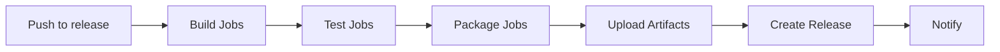

# CI/CD Documentation

Comprehensive guide to the continuous integration and deployment pipelines for Standalone Python.

## Table of Contents

- [Overview](#overview)
- [GitHub Actions Pipeline](#github-actions-pipeline)
- [GitLab CI Pipeline](#gitlab-ci-pipeline)
- [Pipeline Architecture](#pipeline-architecture)
- [Release Process](#release-process)
- [Artifact Management](#artifact-management)
- [Pipeline Optimization](#pipeline-optimization)
- [Security Considerations](#security-considerations)
- [Monitoring and Alerts](#monitoring-and-alerts)
- [Troubleshooting Pipelines](#troubleshooting-pipelines)

## Overview

Standalone Python uses two parallel CI/CD systems:

1. **GitHub Actions**: Primary pipeline for open-source releases
2. **GitLab CI**: Alternative pipeline for enterprise deployments

Both pipelines follow the same build → test → package → release workflow.

### Pipeline Features

- **Matrix Builds**: All Python versions × all architectures
- **Parallel Execution**: Concurrent builds for faster delivery
- **Automated Testing**: Build verification and smoke tests
- **Release Automation**: Tag-based releases with artifacts
- **Artifact Storage**: Compressed binaries with checksums

## GitHub Actions Pipeline

### Workflow File Structure

Location: `.github/workflows/build.yml`

```yaml
name: "release"

on:
  push:
    branches: ["release"]

jobs:
  build:
    runs-on: ubuntu-latest
    strategy:
      matrix:
        architecture: ["x86_64", "x86"]
        version: ["3.12", "3.11", "3.10"]
```

### Build Job

The build job creates Docker images and extracts Python distributions:

```yaml
build:
  runs-on: ubuntu-latest
  strategy:
    matrix:
      architecture: ["x86_64", "x86"]
      version: ["3.12", "3.11", "3.10"]

  steps:
    - name: Checkout code
      uses: actions/checkout@v4

    - name: Build docker image
      run: |
        docker build -t release-${{ github.ref_name }}:${{ matrix.version }}-${{ matrix.architecture }} \
          ./${{ matrix.version }}/${{ matrix.architecture }}/

    - name: Save docker image as tar
      run: |
        docker save release-${{ github.ref_name }}:${{ matrix.version }}-${{ matrix.architecture }} \
          > release-${{ matrix.version }}-${{ matrix.architecture }}.tar

    - name: Extract Python distribution
      run: |
        ./ci/packing_release_tar.sh release-${{ matrix.version }}-${{ matrix.architecture }}.tar

    - name: Compress artifact
      run: |
        gzip -9 build/release-${{ matrix.version }}-${{ matrix.architecture }}.tar

    - name: Upload artifact
      uses: actions/upload-artifact@v4
      with:
        name: release-${{ matrix.version }}-${{ matrix.architecture }}.tar.gz
        path: build/release-${{ matrix.version }}-${{ matrix.architecture }}.tar.gz
```

### Release Job

Automated release creation with all artifacts:

```yaml
release:
  runs-on: ubuntu-latest
  needs: build

  steps:
    - name: Create release tag
      run: |
        git tag release-$(date '+%Y-%m-%d')
        git push origin --tags

    - name: Download artifacts
      uses: actions/download-artifact@v4

    - name: Create GitHub release
      uses: ncipollo/release-action@v1
      with:
        tag: ${{ env.TAG_NAME }}
        artifacts: "artifacts/*/*.tar.gz"
```

### Pipeline Triggers

```yaml
# Trigger on push to release branch
on:
  push:
    branches: ["release"]

# Manual trigger option
on:
  workflow_dispatch:
    inputs:
      version:
        description: 'Python version to build'
        required: true
        default: '3.12'
```

## GitLab CI Pipeline

### Pipeline Configuration

Location: `.gitlab-ci.yml`

```yaml
variables:
  PACKAGE_REGISTRY_URL: "${CI_API_V4_URL}/projects/${CI_PROJECT_ID}/packages/generic/"
  PACKAGE_NAME: "standalone-python"

stages:
  - build
  - generate_release_tag
  - upload
  - generate_release_note
  - release
```

### Build Stage

Parallel matrix builds with logging:

```yaml
build:
  stage: build
  script:
    - docker build -t release-${PACKAGE_NAME}:${version}-${architecture} \
        ./${version}/${architecture}/ \
        1>${version}-${architecture}.log 2>&1
    - docker save release-${PACKAGE_NAME}:${version}-${architecture} \
        > release-${version}-${architecture}.tar
    - bash ci/packing_release_tar.sh release-${version}-${architecture}.tar
    - gzip -9 build/release-${version}-${architecture}.tar

  artifacts:
    paths:
      - build/release-${version}-${architecture}.tar.gz
      - ${version}-${architecture}.log

  parallel:
    matrix:
      - version: ["3.12", "3.11", "3.10"]
        architecture: ["x86_64", "x86"]

  tags: [shell]

  rules:
    - if: $CI_COMMIT_TAG == null
```

### Upload to Package Registry

```yaml
upload:
  stage: upload
  needs: [build]
  script:
    - export PACKAGE_VERSION=$(date '+%Y-%m-%d')
    - |
      curl --header "JOB-TOKEN: $CI_JOB_TOKEN" \
           --upload-file build/release-${version}-${architecture}.tar.gz \
           "${PACKAGE_REGISTRY_URL}${PACKAGE_NAME}/${PACKAGE_VERSION}/release-${version}-${architecture}.tar.gz"
```

### Release Creation

```yaml
release:
  stage: release
  image: registry.gitlab.com/gitlab-org/release-cli:latest
  script:
    - |
      release-cli create --name "${PACKAGE_NAME}" \
        --ref "${CI_COMMIT_REF_NAME}" \
        --tag-name "${TAG_NAME}" \
        --description generated_release_notes.txt
```

## Pipeline Architecture

### Build Matrix

Total of 6 parallel builds:

```
┌──────────────────────────────────────┐
│          Pipeline Trigger            │
└──────────────────────────────────────┘
                    ↓
        ┌──────────────────┐
        │   Build Stage    │
        └──────────────────┘
            ↓ (parallel)
    ┌───────────────────────────┐
    │  Python 3.12 x86_64       │
    │  Python 3.12 x86          │
    │  Python 3.11 x86_64       │
    │  Python 3.11 x86          │
    │  Python 3.10 x86_64       │
    │  Python 3.10 x86          │
    └───────────────────────────┘
                    ↓
        ┌──────────────────┐
        │  Package Stage   │
        └──────────────────┘
                    ↓
        ┌──────────────────┐
        │  Release Stage   │
        └──────────────────┘
```

### Pipeline Flow



### Parallel Execution Strategy

```yaml
# Optimal parallelization
parallel:
  matrix:
    - version: ["3.12", "3.11", "3.10"]
      architecture: ["x86_64", "x86"]
  max_parallel: 6  # All builds run simultaneously
```

## Release Process

### Versioning Strategy

Date-based releases: `release-YYYY-MM-DD`

```bash
# Automatic tag generation
TAG_NAME="release-$(date '+%Y-%m-%d')"

# Version in artifacts
FILENAME="standalone-python-${VERSION}-${ARCH}-${DATE}.tar.gz"
```

### Release Workflow

1. **Code Freeze**: Merge to release branch
2. **Build Trigger**: CI/CD pipeline starts
3. **Matrix Builds**: All versions built in parallel
4. **Testing**: Automated smoke tests
5. **Packaging**: Compression and checksums
6. **Upload**: Artifacts to registry
7. **Release**: Create GitHub/GitLab release
8. **Notification**: Alert stakeholders

### Manual Release

```bash
# Trigger release manually
git checkout -b release
git push origin release

# Or use GitHub Actions manual trigger
gh workflow run build.yml
```

## Artifact Management

### Artifact Structure

```
artifacts/
├── release-3.12-x86_64.tar.gz
├── release-3.12-x86_64.tar.gz.sha256
├── release-3.12-x86.tar.gz
├── release-3.12-x86.tar.gz.sha256
├── release-3.11-x86_64.tar.gz
├── release-3.11-x86_64.tar.gz.sha256
├── release-3.11-x86.tar.gz
├── release-3.11-x86.tar.gz.sha256
├── release-3.10-x86_64.tar.gz
├── release-3.10-x86_64.tar.gz.sha256
├── release-3.10-x86.tar.gz
└── release-3.10-x86.tar.gz.sha256
```

### Artifact Storage

**GitHub Actions**:
```yaml
- uses: actions/upload-artifact@v4
  with:
    name: release-${{ matrix.version }}-${{ matrix.architecture }}
    path: build/*.tar.gz
    retention-days: 90
```

**GitLab CI**:
```yaml
artifacts:
  paths:
    - build/*.tar.gz
  expire_in: 3 months
```

### Artifact Verification

```bash
# Download and verify
wget <artifact-url>
sha256sum -c release-*.sha256

# Extract and test
tar -xzf release-3.12-x86_64.tar.gz
./opt/python/bin/python --version
```

## Pipeline Optimization

### Build Caching

**Docker Layer Caching**:
```yaml
- name: Setup Docker Buildx
  uses: docker/setup-buildx-action@v2
  with:
    cache-from: type=gha
    cache-to: type=gha,mode=max
```

**Dependency Caching**:
```yaml
- name: Cache dependencies
  uses: actions/cache@v3
  with:
    path: ~/.cache
    key: ${{ runner.os }}-deps-${{ hashFiles('**/deplib/*.sh') }}
```

### Parallel Optimization

```yaml
# Optimize runner distribution
strategy:
  matrix:
    include:
      - version: "3.12"
        architecture: "x86_64"
        runs-on: ubuntu-latest-8-cores  # Faster runner
      - version: "3.10"
        architecture: "x86"
        runs-on: ubuntu-latest  # Standard runner
```

### Build Time Reduction

```bash
# Skip unnecessary stages
docker build --target python_builder  # Stop after Python build

# Use BuildKit
DOCKER_BUILDKIT=1 docker build ...

# Parallel make
make -j$(nproc)  # Use all CPU cores
```

## Security Considerations

### Secret Management

**GitHub Actions**:
```yaml
env:
  GITHUB_TOKEN: ${{ secrets.GITHUB_TOKEN }}
  SIGNING_KEY: ${{ secrets.SIGNING_KEY }}
```

**GitLab CI**:
```yaml
variables:
  GIT_TOKEN: ${CI_JOB_TOKEN}  # Automatic
  DEPLOY_KEY: ${DEPLOY_KEY}    # From CI/CD settings
```

### Security Scanning

```yaml
- name: Security scan
  run: |
    # Scan for vulnerabilities
    trivy image standalone-python:${{ matrix.version }}

    # Check for secrets
    gitleaks detect --source .

    # SAST scanning
    semgrep --config=auto .
```

### Artifact Signing

```bash
# Sign artifacts with GPG
gpg --detach-sign --armor release-*.tar.gz

# Verify signature
gpg --verify release-*.tar.gz.asc release-*.tar.gz
```

## Monitoring and Alerts

### Pipeline Monitoring

**GitHub Actions Status**:
```yaml
- name: Send notification
  if: failure()
  uses: actions/github-script@v6
  with:
    script: |
      github.rest.issues.create({
        owner: context.repo.owner,
        repo: context.repo.repo,
        title: 'Build failed: ${{ matrix.version }}-${{ matrix.architecture }}',
        body: 'Check the logs: ${{ github.server_url }}/${{ github.repository }}/actions/runs/${{ github.run_id }}'
      })
```

**GitLab CI Notifications**:
```yaml
after_script:
  - |
    if [ "$CI_JOB_STATUS" == "failed" ]; then
      curl -X POST $SLACK_WEBHOOK -d '{"text":"Build failed: '"$CI_JOB_NAME"'"}'
    fi
```

### Metrics Collection

```yaml
- name: Collect metrics
  run: |
    echo "build_time_seconds{version=\"$VERSION\",arch=\"$ARCH\"} $BUILD_TIME" >> metrics.txt
    echo "artifact_size_bytes{version=\"$VERSION\",arch=\"$ARCH\"} $(stat -f%z *.tar.gz)" >> metrics.txt
```

## Troubleshooting Pipelines

### Common Issues

**Issue: Docker build timeout**
```yaml
# Solution: Increase timeout
- name: Build with timeout
  timeout-minutes: 180  # 3 hours
  run: docker build ...
```

**Issue: Artifact upload fails**
```yaml
# Solution: Retry logic
- name: Upload with retry
  uses: nick-invision/retry@v2
  with:
    timeout_minutes: 10
    max_attempts: 3
    command: |
      actions/upload-artifact@v4
```

**Issue: Out of disk space**
```yaml
# Solution: Clean between builds
- name: Cleanup
  run: |
    docker system prune -af
    rm -rf /tmp/*
```

### Debug Mode

**Enable debug logging**:
```yaml
# GitHub Actions
env:
  ACTIONS_RUNNER_DEBUG: true
  ACTIONS_STEP_DEBUG: true

# GitLab CI
variables:
  CI_DEBUG_TRACE: "true"
```

### Pipeline Testing

**Local testing with act**:
```bash
# Install act
brew install act  # macOS
# or
curl https://raw.githubusercontent.com/nektos/act/master/install.sh | sudo bash

# Test workflow locally
act -j build --matrix version:3.12 --matrix architecture:x86_64
```

**GitLab CI local testing**:
```bash
# Install gitlab-runner
brew install gitlab-runner

# Test job locally
gitlab-runner exec docker build \
  --env "version=3.12" \
  --env "architecture=x86_64"
```

## Advanced Configurations

### Multi-Stage Releases

```yaml
# Development releases
on:
  push:
    branches: [dev]
    tags: ['dev-*']

# Production releases
on:
  push:
    branches: [main, release]
    tags: ['v*', 'release-*']
```

### Cross-Repository Dependencies

```yaml
- name: Checkout dependencies
  uses: actions/checkout@v4
  with:
    repository: org/dependency-repo
    path: deps
```

### Custom Runners

```yaml
# Self-hosted runner for sensitive builds
runs-on: [self-hosted, linux, x64, gpu]

# Runner with specific tools
runs-on: ${{ matrix.runner }}
strategy:
  matrix:
    include:
      - runner: ubuntu-latest
        tools: standard
      - runner: buildjet-4vcpu-ubuntu-2204
        tools: performance
```

## Best Practices

### 1. Pipeline as Code

- Version control all pipeline configurations
- Use YAML anchors to reduce duplication
- Comment complex logic
- Keep pipelines modular

### 2. Fail Fast

```yaml
strategy:
  fail-fast: true  # Stop all jobs if one fails
  matrix: ...
```

### 3. Resource Management

```yaml
# Cancel previous runs
concurrency:
  group: ${{ github.ref }}
  cancel-in-progress: true
```

### 4. Artifact Retention

```yaml
# Balance storage vs availability
artifacts:
  expire_in: 30 days  # Development
  expire_in: 1 year   # Releases
```

### 5. Security First

- Never commit secrets
- Use environment variables
- Scan all artifacts
- Sign releases

## Next Steps

- Configure your own pipeline: [CONTRIBUTING.md](CONTRIBUTING.md)
- Build locally: [BUILD.md](BUILD.md)
- Understand the architecture: [ARCHITECTURE.md](ARCHITECTURE.md)
- Deploy releases: [INSTALLATION.md](INSTALLATION.md)

---

*For pipeline status and recent builds, check the [Actions tab](https://github.com/your-repo/standalone-python/actions) on GitHub or the [CI/CD > Pipelines](https://gitlab.com/your-repo/standalone-python/-/pipelines) page on GitLab.*